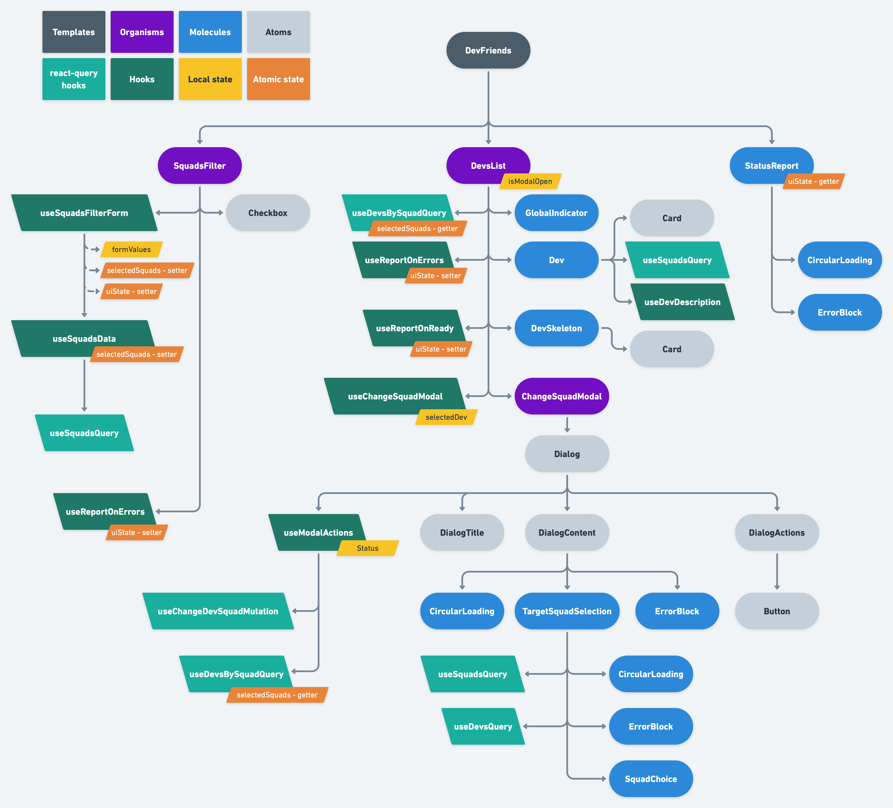

# Workshop

Here is a little workshop to help my team move forward with our frontend :sparkles:

<!-- readme-package-icons start -->

&nbsp;&nbsp;&nbsp;&nbsp;&nbsp;&nbsp;&nbsp;&nbsp;&nbsp;&nbsp;&nbsp;&nbsp;&nbsp;&nbsp;&nbsp;&nbsp;&nbsp;

<!-- readme-package-icons end -->

This is a continuation of the [Workshop react FCs repo](https://github.com/jpb06/workshop-react-fcs). Take a look at this archived repo if you want to know more about old implementations like the ones based on redux, for example.

You can find the [deployed app here](https://workshop-react-front.vercel.app).

## ⚡ What is this repo about?

The original repo was created to convince everyone about React 16.8 features: hooks. Using only function components and hook is just great! Then the subject shifted to redux. Let's just say good bye to redux and its ecosystem for asynchronous tasks (thunks, sagas, whatever floats your boat).

You will find a few branches on [the original repo](https://github.com/jpb06/workshop-react-fcs); from oldest to newest:

| Branch                                                                          | Description                                                                                                   |
| ------------------------------------------------------------------------------- | ------------------------------------------------------------------------------------------------------------- |
| ❌ [noredux](https://github.com/jpb06/workshop-react-fcs/tree/noredux)          | Bearbone comparison between class components and FCs/hooks, using CRA                                         |
| ❌ [redux](https://github.com/jpb06/workshop-react-fcs/tree/redux)              | Adding redux & redux-thunk to the mix. Still using CRA                                                        |
| ❌ [react-query](https://github.com/jpb06/workshop-react-fcs/tree/react-query/) | No more redux. Time for server state libraries! Using nextjs this time and making sure we reach 100% coverage |

The current repo is an import of the react-query branch. We splitted frontend and backend in two different repos to tackle deployment issues.

## ⚡ Guidelines

### 🔶 [General guidelines](./docs/bp-general-guidelines.md)

### 🔶 [Making sure we are understood](./docs/bp-conveyintent-guidelines.md)

### 🔶 [Code guidelines](./docs/bp-code-guidelines.md)

### 🔶 [Frontend guidelines](./docs/bp-frontend-guidelines.md)

## ⚡ The Dev Friends application

Our objective here is to display a list of developers that can be filtered by their squad. We also want to be able to change the squad of a developer.

We will follow the guidelines described above. Let's take a look at the components tree of the app:

## ⚡ Backend

You can find the backend repo [here](https://github.com/jpb06/workshop-react-backend). It's a barebone express, so not much to see there.

Let's just list quickly the routes exposed by the backend:

| Route                 | Verb    | Description                                                             |
| --------------------- | ------- | ----------------------------------------------------------------------- |
| 💥 /squads            | 🔹 GET  | Retrieves all squads                                                    |
| 💥 /squads/{id}/devs  | 🔹 GET  | Retrieves all devs belonging to a squad                                 |
| 💥 /devs              | 🔹 GET  | Retrieves all devs                                                      |
| 💥 /devs/by-squad     | 🔸 POST | Retrieves devs belonging to a list of squads passed in the request body |
| 💥 /devs/change-squad | 🔸 POST | Moves a developer to another squad                                      |
